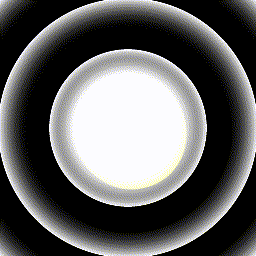

# BodhiraLightingController
This is the touchdesigner-based software to live-control the kinetic light installation "Bodhira" in festival or live-music like events. The Project provides a UserInterface and allows to controll lighting effects and color as well as movement states using a touchscreen, PS3-Controller or DMX. It integrated in a DMX lighting Environment.

## Contents

- [Overview & UI](#Overview-&-UI)
- [Controls](#controls)
  - [DMX-Overview](#DMX-Overview)
- [Contributors](#Contributors)

## Overview & UI

Bodhira's Lighting Effects are controlled using 2 Layers of 2D-Texture Effects. There are the Base-Effects intended to be used for longer display and Overlay-Effects intended for shorter bursts of excitement. These Overlay-Effects can be triggered simultniously and if done so thex mix. Additionally there are Color-Presets (1 Color scheme for Overlay and BaseEffect) added wich can  be overwirtten by RGB values to the desired Color. 

All Effects as well al Motor-Movement and additional Effects are bound to a global Tap-Tempo wich can be Tapped-In at any time.

Additionall Post-Effects that can be used fo further expression: 
* Feedback: adds a Feedback-Effect wich smoothes out textures, enhances their Brightness and is generally a good practice for transitions and just playing around
* Glitch: well as the Name suggests this will Glitch-Up the current Textures and is variable in Strength
* Strobe: This adds Storbing Effect wich still will integrate parts of the Texture and is affected by the Feedback
* Beat-Enahncer:  adds global Dimmer-Effect matched to the Beat
* Auto-ColorShifter: continously changes the color over Time (slowly)

There are other Settings regarding the Motor and FadeTimes of the Effects wich should be pretty much self explanatory. 

Also IP-Adresses can be set as well as Debuging Feature - BUT THIS IS FOr THE TEAM ONLY!!!

Here you can have a look at the UI wich displays all controlable values:

## Controls

Bodhira can be controlled using the UI via a Touchscreen, using a PS§-Controller (only the Team can!!) or DMX-Input from e.g. a lighting console. Here is an Overview of the DMX-Controlls:

### DMX-Overview 

| Ch   | Name                     | Range         | Value                       | Description                                                        | Image    |
|------|--------------------------|---------------|-----------------------------|--------------------------------------------------------------------|----------|
| 1    | **Tap-Tempo**            |               |                             |                                                                    |          |
|      |                          | 0             | off                         |                                                                    |          |  
|      |                          | 1-255         | on                          | for taping in the Tempo, controls effect and Motor Speed           |          |
| 2    | **Main-Dimmer**          |               |                             |                                                                    |          |
|      |                          | 0 - 255       | Dimmer-Value                | set the global brightness                                          |          |
| 3    | **Color-Presets**        |               |                             |                                                                    |          | 
|      |                          | 15 - 42       | Color-Preset 1              | dark blue - red                                                    |  |  
|      |                          | 43 - 70       | Color-Preset 2              | blue                                                               |  |
|      |                          | 71 - 99       | Color-Preset 3              | pink                                                               |  |
|      |                          | 100 - 172     | Color-Preset 4              | green                                                              |  |
|      |                          | 128 - 155     | Color-Preset 5              | lime                                                               |  |
|      |                          | 156 - 184     | Color-Preset 6              | red - orange                                                       |  |
|      |                          | 185 - 212     | Color-Preset 7              | dark red                                                           |  |
|      |                          | 213 - 255     | Color-Preset 8              | white                                                              |  |
| 4    | **Color-Preset FadeTime**|               |                             |                                                                    |      |
|      |                          | 0 - 255       | FadeTime - Value            | set the Time for Fading between Color-Presets                      |      |
| 5    | **RGB Overwrite On/Off** |               |                             |                                                                    |      |
|      |                          | 0             | off                         |                                                                    |          |  
|      |                          | 1-255         | on                          | activates the Overwrite RGB-Color set -- see below                 |          |
| 6    | **Overwrite Color - R**  |               |                             |                                                                    |      |
|      |                          | 0 - 255       | Red-Value                   | set the Amount of Red in Overwrite Color                           |      |
| 7    | **Overwrite Color - G**  |               |                             |                                                                    |      |
|      |                          | 0 - 255       | Green-Value                 | set the Amount of Green in Overwrite Color                         |      |
| 8    | **Overwrite Color - B**  |               |                             |                                                                    |      |
|      |                          | 0 - 255       | Blue-Value                  | set the Amount of Blue in Overwrite Color                          |      |
| 9    | **Auto - ColorShift**    |               |                             |                                                                    |      |
|      |                          | 0             | off                         |                                                                    |          |  
|      |                          | 1-255         | on                          | activates the Automatic Shift of Colors (slowly over Time)         |          |
| 10    | **Overlay-Effect 1**    |               |                             |                                                                    |      |
|      |                          | 0             | off                         |                                                                    |          |  
|      |                          | 1-255         | on                          | circular swoosh                                                    | |
| 11    | **Overlay-Effect 2**    |               |                             |                                                                    |      |
|      |                          | 0             | off                         |                                                                    |          |  
|      |                          | 1-255         | on                          | slow circular swoosh                                               | |
| 12    | **Overlay-Effect 3**    |               |                             |                                                                    |      |
|      |                          | 0             | off                         |                                                                    |          |  
|      |                          | 1-255         | on                          | noisy sparkles                                                     | |
| 13    | **Overlay-Effect 4**    |               |                             |                                                                    |      |
|      |                          | 0             | off                         |                                                                    |          |  
|      |                          | 1-255         | on                          | noisy sparkle swoosh                                               | |
| 14    | **Overlay-Effect 5**    |               |                             |                                                                    |      |
|      |                          | 0             | off                         |                                                                    |          |  
|      |                          | 1-255         | on                          | radial chaser                                                      | |
| 15    | **Overlay-Effect 6**    |               |                             |                                                                    |      |
|      |                          | 0             | off                         |                                                                    |          |  
|      |                          | 1-255         | on                          | full circle repetition                                             | |
| 16    | **Overlay-Effect 7**    |               |                             |                                                                    |      |
|      |                          | 0             | off                         |                                                                    |          |  
|      |                          | 1-255         | on                          | half circle repetition                                             | |
| 17    | **Overlay-Effect 8**    |               |                             |                                                                    |      |
|      |                          | 0             | off                         |                                                                    |          |  
|      |                          | 1-255         | on                          | pulsing circle with repetition                                     | |
| 18   | **Overlay - FadeIn Time**    |               |                             |                                                                    |      |
|      |                          | 0 - 255       | FadeIn Time - Value         | set the Time for fading in the Overlay-Effects                      |      |
| 19    | **Overlay - FadeOut Time**   |               |                             |                                                                    |      |
|      |                          | 0 - 255       | FadeOut Time - Value        | set the Time for fading out the Overlay-Effects                     |      |
| 20    | **Base-Effects**             |               |                             |                                                                    |      |
|      |                          | 15 - 42       | Base-Effect 1               | continuous circular movement                                       |  |
|      |                          | 43 - 70       | Base-Effect 2               | slow, wide circular movement                                       |  |
|      |                          | 71 - 99       | Base-Effect 3               | slow small circular movement                                       |  |
|      |                          | 100 - 172     | Base-Effect 4               | abstract circular movement 1                                       |  |
|      |                          | 128 - 155     | Base-Effect 5               | abstract circular movement 2                                       |  |
|      |                          | 156 - 184     | Base-Effect 6               | disrupted rectangular movement                                     |  |
|      |                          | 185 - 212     | Base-Effect 7               | slow noise movement 1                                              |  |
|      |                          | 213 - 255     | Base-Effect 8               | slow noise movement 2                                              |  |
| 21   | **Base-Effect - FadeTime**   |               |                             |                                                                    |      |
|      |                          | 0 - 255       | FadeTime - Value            | set the time for fading between Base-Effects                       |      |
| 22   | **Motor-Power**              |               |                             |                                                                    |      |
|      |                          | 0             | off                         | stop the Motor                                                     |      |
|      |                          | 255           | on                          | start the Motor                                                    |      |
| 23   | **Motor-Gear**               |               |                             |                                                                    |      |
|      |                          | 0             | slow                        | set the Movement to slow                                           |      |
|      |                          | 255           | fast                        | set the Movement to fast                                           |      |
| 24   | **Motor-SlowDown**           |               |                             |                                                                    |      |
|      |                          | 0             | off                         |                                                                    |      |
|      |                          | 255           | Slow-Down                   | temporarily slow down the Movement, good for syncing movement to beat |      |
| 25   | **Strobe**            |               |                             |                                                                    |      |
|      |                          | 0             | off                         |                                                                    |          |  
|      |                          | 1-255         | on                          | activates Strobing - yeeah!                                           |         |
| 26   | **Gltich**            |               |                             |                                                                    |      |
|      |                          | 0 - 255       | Glitch - Intensity     | control the intensity of the Glitch-Effect |      |
| 27   | **Feedback**                 |               |                             |                                                                    |      |
|      |                          | 0 - 255       | Feedback Intensity          | control the intensity of a simple Feedback Effect, good for smoothing out transitions or performative playfulness |      |
| 28   | **Beat-Enhancer**            |               |                             |                                                                    |      |
|      |                          | 0 - 255       | Beat-Enhancer Intensity     | control the intensity of an automatic, beat-matched simple Dim-Effect |      |

## Contributors

This Project was initalized by Daniel Baer. He did a lot of work resarching and engineering the hardware part, including welding, wireing drilling, 3D-Printing, Arduino Programing and on and on... Me (Tim Auzinger) entered the project at a later point and I developed the touchdesigner based lighting control software including the pixelmapping and so on. The Project owner is Daniel Baer and for questions regarding showcase or anything like that he is the one to ask.

